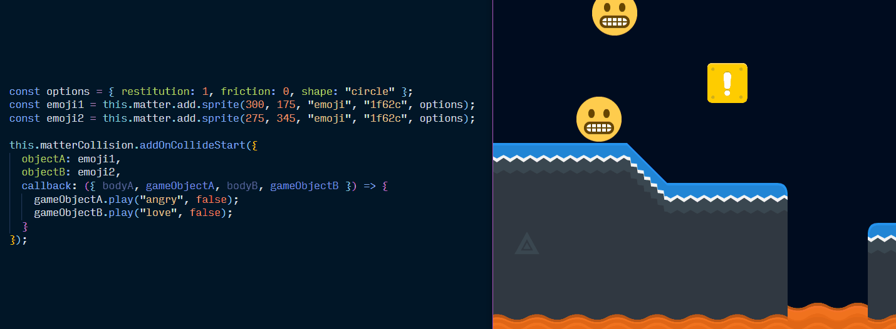

# Phaser Matter Collision Plugin 💥 <!-- omit in toc -->

A plugin for making it easier to manage collisions with the [Phaser](https://phaser.io/) game engine and the [Matter.js](http://brm.io/matter-js/) physics engine.

Matter is one of the cool physics engine choices you have in Phaser 3. Phaser has a thin wrapper over Matter's API, so you need to dig into Matter's native collision event system if you want to detect and respond to collisions. That system just gives you a dump of all the pairs of bodies that collided in a tick of the engine. This plugin wraps up that collision logic in a friendlier, more modular way:

```js
const player = this.matter.add.sprite(0, 0, "player");
const trapDoor = this.matter.add.sprite(200, 0, "door");

this.matterCollision.addOnCollideStart({
  objectA: player,
  objectB: trapDoor,
  callback: () => console.log("Player touched door!")
});
```

Or in a slightly more complicated example:

[](https://raw.githubusercontent.com/mikewesthad/phaser-matter-collision-plugin/master/doc-source-assets/collision-simple-demo.gif)
_See the interactive version of that example on [codesandbox](https://codesandbox.io/s/0o0917m23l?module=%2Fjs%2Findex.js)._

If you are reading this on Github or NPM, check out the full HTML documentation [here](https://www.mikewesthad.com/phaser-matter-collision-plugin/docs/manual/README.html).

## Info

This repository uses yarn workspaces to keep the plugin source code together with some example JavaScript and TypeScript projects. See the individual workspaces for more info on each:

- `workspaces/plugin`
- `workspaces/javascript-example`
- `workspaces/typescript-example`

## Development

If you are contributing to this library, here is how to get started:

- Install [Node](https://nodejs.org/en/)
- `npm install --global yarn`
- Open the root folder of this repository and run `yarn`.
- Head to the workspace you plan to work on and use `yarn run XYZ` to run a script from that workspace.