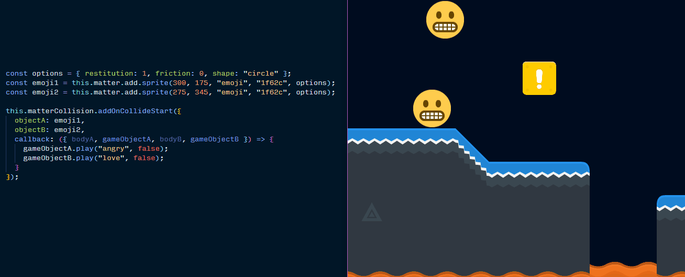

# Phaser Matter Collision Plugin 💥 <!-- omit in toc -->

A plugin for making it easier to manage collisions with the [Phaser](https://phaser.io/) game engine and the [Matter.js](http://brm.io/matter-js/) physics engine.

Matter is one of the cool physics engine choices you have in Phaser 3. Phaser has a thin wrapper over Matter's API, so you need to dig into Matter's native collision event system if you want to detect and respond to collisions. That system just gives you a dump of all the pairs of bodies that collided in a tick of the engine. This plugin wraps up that collision logic in a friendlier, more modular way:

```js
const player = this.matter.add.sprite(0, 0, "player");
const trapDoor = this.matter.add.sprite(200, 0, "door");

this.matterCollision.addOnCollideStart({
  objectA: player,
  objectB: trapDoor,
  callback: () => console.log("Player touched door!")
});
```

Or in a slightly more complicated example:

[](https://raw.githubusercontent.com/mikewesthad/phaser-matter-collision-plugin/master/doc-source-assets/collision-simple-demo.gif)
_See the interactive version of that example on [codesandbox](https://codesandbox.io/s/0o0917m23l?module=%2Fjs%2Findex.js)._

If you are reading this on Github or NPM, check out the HTML documentation [here](https://www.mikewesthad.com/phaser-matter-collision-plugin/docs/manual/README.html).

- [Installation](#installation)
  - [As a Script](#as-a-script)
  - [As a Module](#as-a-module)
- [Usage](#usage)
  - [Initial Setup](#initial-setup)
  - [Usage in Scene](#usage-in-scene)
    - [Tracking Collisions](#tracking-collisions)
    - [Stop Tracking Collisions](#stop-tracking-collisions)
- [Examples](#examples)
- [Changelog](#changelog)
- [Development](#development)
  - [Scripts](#scripts)
  - [Tests](#tests)

## Installation

You can install this plugin globally as a script, or locally as a module using your bundler of choice.

### As a Script

You can drop in any of the transpiled code into your project as a standalone script. Choose the version that you want:

- [minified code](https://raw.githubusercontent.com/mikewesthad/phaser-matter-collision-plugin/master/dist/phaser-matter-collision-plugin.min.js) & optional [source map](https://raw.githubusercontent.com/mikewesthad/phaser-matter-collision-plugin/master/dist/phaser-matter-collision-plugin.min.js.map)
- [unminified code](https://raw.githubusercontent.com/mikewesthad/phaser-matter-collision-plugin/master/dist/phaser-matter-collision-plugin.js) & optional [source map](https://raw.githubusercontent.com/mikewesthad/phaser-matter-collision-plugin/master/dist/phaser-matter-collision-plugin.js.map)

E.g. if you wanted the minified code, you would add this to your HTML:

```html
<script src="phaser-matter-collision-plugin.min.js"></script>
```

Or use the jsdelivr CDN:

```html
<script src="//cdn.jsdelivr.net/npm/phaser-matter-collision-plugin"></script>
```

Now you can use the global `PhaserMatterCollisionPlugin`. See [usage](#usage) for how to use the plugin.

### As a Module

Install via npm:

```
npm install --save phaser-matter-collision-plugin
```

To use the transpiled and minified distribution of the library:

```js
import PhaserMatterCollisionPlugin from "phaser-matter-collision-plugin";
```

To use the raw library (so you can transpile it to match your own project settings):

```js
import PhaserMatterCollisionPlugin from "phaser-matter-collision-plugin/src";
```

See [usage](#usage) for how to use the plugin.

## Usage

### Initial Setup

When setting up your game config, add the plugin:

```js
const config = {
  // ...
  physics: {
    default: "matter"
  },
  // Install the scene plugin
  plugins: {
    scene: [
      {
        plugin: PhaserMatterCollisionPlugin, // The plugin class
        key: "matterCollision", // Where to store in Scene.Systems, e.g. scene.sys.matterCollision
        mapping: "matterCollision" // Where to store in the Scene, e.g. scene.matterCollision
      }
    ]
  }
};

const game = new Phaser.Game(config);
```

Now, within a scene, you can use `this.matterCollision` to access the plugin instance.

### Usage in Scene

#### Tracking Collisions

The plugin has `addOnCollideStart`, `addOnCollideActive` and `addOnCollideEnd` methods which allow you to listen to collisions between "objects" in your scene. Those objects can be: a native Matter body, a tile, a Matter sprite, any object with a `body` property, or an array of any of those.

For example, game object vs game object collisions:

```js
const player = this.matter.add.sprite(0, 0, "player");
const trapDoor = this.matter.add.image(200, 0, "door");

this.matterCollision.addOnCollideStart({
  objectA: player,
  objectB: trapDoor,
  callback: function(eventData) {
    // This function will be invoked any time the player and trap door collide
    const { bodyA, bodyB, gameObjectA, gameObjectB, pair } = eventData;
    // bodyA & bodyB are the Matter bodies of the player and door respectively
    // gameObjectA & gameObjectB are the player and door respectively
    // pair is the raw Matter pair data
  },
  context: this // Context to apply to the callback function
});
```

If you omit the `objectB` property, you'll get all collisions involving `objectA`:

```js
const player = this.matter.add.sprite(0, 0, "player");

this.matterCollision.addOnCollideStart({
  objectA: player,
  callback: eventData => {
    const { bodyB, gameObjectB } = eventData;
    console.log("Player touched something.");
    // bodyB will be the matter body that the player touched
    // gameObjectB will be the game object that owns bodyB, or undefined if there's no game object
  }
});
```

Game object vs Matter sensor:

```js
const player = this.matter.add.sprite(0, 0, "player");
const sensor = this.matter.world.add.rectangle(100, 0, 50, 50, { isStatic: true, isSensor: true });

this.matterCollision.addOnCollideStart({
  objectA: player,
  objectB: sensor,
  callback: eventData => console.log("Player touched hidden sensor")
});
```

Game object vs array of objects:

```js
const player = this.matter.add.sprite(0, 0, "player");
const enemy1 = this.matter.add.sprite(100, 0, "enemy");
const enemy2 = this.matter.add.sprite(200, 0, "enemy");
const enemy3 = this.matter.add.sprite(300, 0, "enemy");

this.matterCollision.addOnCollideStart({
  objectA: player,
  objectB: [enemy1, enemy2, enemy3],
  callback: eventData => {
    console.log("Player hit an enemy");
    // eventData.gameObjectB will be the specific enemy that was hit!
  }
});
```

Or, array vs array:

```js
this.matterCollision.addOnCollideStart({
  objectA: [player1, player2],
  objectB: [enemy1, enemy2, enemy3],
  callback: eventData => {
    console.log("A player hit an enemy");
    // eventData.gameObjectA will be the specific player involved in the collision
    // eventData.gameObjectB will be the specific enemy involved in the collision
  }
});
```

You can listen for collisions vs a single tile (or an array of tiles), but it's likely more useful to do something like:

```js
this.matterCollision.addOnCollideStart({
  objectA: player,
  callback: eventData => {
    const { bodyB, gameObjectB } = eventData;

    if (gameObjectB !== undefined && gameObjectB instanceof Phaser.Tilemaps.Tile) {
      // Now you know that gameObjectB is a Tile, so you can check the index, properties, etc.
      if (gameObjectB.properties.isDeadly) console.log("Stepped on deadly tile");
      else if (gameObjectB.index === 32) console.log("Stepped on the tile with index 32");
    }
  }
});
```

The plugin also exposes two sets of events via the `this.matterCollision.events` event emitter:

- "collisionstart", "collisionactive", "collisionend" - these match the Matter events. They emit a single parameter `event`. Aside from the normal Matter data in `event`, each pair in `event.pairs` has a `gameObjectA` and `gameObjectB` property that points to the game object that owns each body (if one exists).
- "paircollisionstart", "paircollisionactive", "paircollisionend" - these are similar to the above, except they fire once for each pair. They have one parameter that looks like this: `{ bodyA, bodyB, gameObjectA, gameObjectB, pair }`

You can listen to them via `this.matterCollision.events.on("collisionstart", ...)`.

#### Stop Tracking Collisions

You can stop tracking a collision via `removeOnCollideStart`, `removeOnCollideActive` and `removeOnCollideEnd`. They take the same parameters as `addOnCollideStart`. E.g.:

```js
function onCollide() {
  console.log("A player hit an enemy");
}

// ... after addOnCollideStart has been used

this.matterCollision.removeOnCollideStart({
  objectA: [player1, player2],
  objectB: [enemy1, enemy2, enemy3],
  callback: onCollide
});
```

In addition, the addOnCollide methods will also return a function that automatically unsubscribes from the collision event (which can be useful if you use arrow functions):

```js
const unsubscribe = this.matterCollision.addOnCollideStart({
  objectA: player,
  objectB: trapDoor,
  callback: eventData => {
    // Do something, like dropping the door out underneath the player
    // Then unsubscribe so this callback is never called again
    unsubscribe();
  }
});
```

If you want to remove all listeners that have been added - not just one colliding pair - there are also the following methods:

- `removeAllCollideStartListeners`
- `removeAllCollideActiveListeners`
- `removeAllCollideEndListeners`
- `removeAllCollideListeners` - removes start, active and end listeners

## Examples

There's one example at the moment. You can check it out on CodeSandbox (which uses the plugin imported from npm):

[](https://codesandbox.io/s/0o0917m23l?module=%2Fjs%2Findex.js)

[](https://codesandbox.io/s/0o0917m23l?module=%2Fjs%2Findex.js)

Or you can check out the same example, but with the plugin loaded via a CDN in the [examples folder](https://github.com/mikewesthad/phaser-matter-collision-plugin/tree/master/examples).

You can also poke around the ["tests" folder](https://github.com/mikewesthad/phaser-matter-collision-plugin/tree/master/tests) of this repository for usage examples.

TODO: add a module example and a script example

## Changelog

Version 0.10.2 - 2019-02-19

- Bug: fixed a bug in `addOnCollide()` that threw an error when the user didn't supply a callback, from [@jvanroose](https://github.com/jvanroose)

Version 0.10.1 - 2018-11-17

- Bug: fixed a bug in the removeOnCollideXXXX methods of the plugin, from [@Fantasix](https://github.com/Fantasix)

## Development

To set up the project for local development make sure you have node and npm installed. You can grab them bundled together [here](https://nodejs.org/en/). Clone/download the repository and run `npm i` from a terminal within the folder.

### Scripts

The project is controlled by npm scripts and uses cypress & jest for testing. Cypress is used for end-to-end verification that the plugin works as expected with Phaser. Jest is used for unit testing the plugin (via heavy mocking since Phaser headless mode is not complete).

- The `watch` and `build` tasks will build the plugin source in library/ or the projects in tests/
- The `serve` task opens the whole project (starting at the root) in a server
- The `dev` task will build & watch the library, tests and open up the server. This is useful for creating tests and updating the library.
- The `dev:cypress` task will build & watch the library & tests, as well as open up cypress in headed mode. This is useful for checking out individual tests and debugging them.
- The `test:cypress` task will build the tests and run cypress in headless mode to check all end-to-end tests.
- The `test:jest` will run the jest tests.

### Tests

The cypress tests rely on a particular structure:

- Each test game inside of "tests/" should have an "index.html" file as the entry point. "src/js/index.js" will be compiled to "build/js/index.js" by webpack. (Cypress doesn't support `type="module"` on scripts, so this is necessary if we need modules.)
- Each test has access to `test-utils.js` which provides `startTest`, `passTest` and `failTest` methods. Call `startTest` at the beginning and pass/fail when the test passes/fails. This manipulates in the DOM in a way that cypress is expecting.
- Each test in "cypress/integration/" simply loads up the specified URL and waits for it to pass or timeout. (Technically, startTest and failTest are ignored, but they are useful for visual inspection of a test.)

The jest unit tests rely on a simple mocking of Phaser and Matter. They are stored inside "src/". Once Phaser headless is available, this testing structure could be re-evaluated.

### New Releases

To prepare a new release, verify that all tests pass with `npm run test:jest` and `npm run test:cypress`, and then:

```
npm login
npm version [<newversion> | major | minor | patch | ...]
npm publish
```
